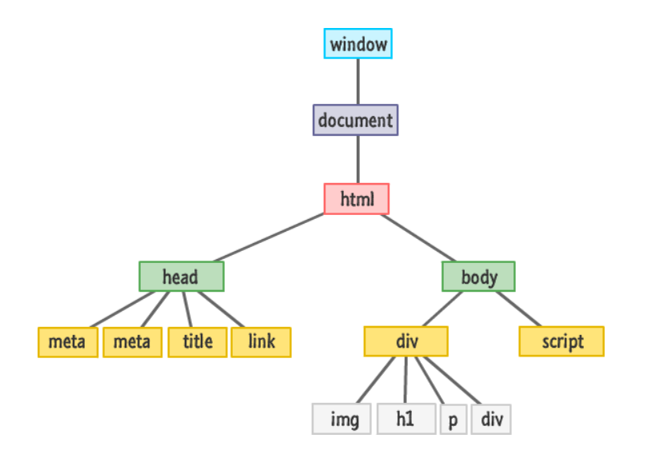

# 1. What is the DOM? How does the DOM work?

The _DOM_ is and acronym for _Document Object Model_.

The DOM - is a tree structure representing different elements of an HTML page, and each HTML element is a “node.”

Main node types (most often work with them) in the DOM:

- Element nodes
- Text nodes
- Comment nodes

The nodes in the DOM are also referred to as parents, children, and siblings, depending on their relation to other nodes.

# 2. Explain the difference between layout, painting and compositing?

**Layout**

Browser will determine how much space each element takes up and where to place it.

**Painting**

This is the process of filling in pixels. It involves drawing out elements.

**Compositing**

Browser draws element to the screen in the correct order so the page renders correctly.

# 3. What are the Benefits of Server Side Rendering (SSR) Over Client Side Rendering (CSR)?

- Performance benefit for customers (the initial page of the website load is faster as there are fewer codes to render)
- Search engines can crawl the site for better SEO

# 4. What is difference between Select and Datalist?

| select                                                 | datalist                                                                              |
| ------------------------------------------------------ | ------------------------------------------------------------------------------------- |
| User can choose only one option from the given list    | User can choose any option from the given list but can also use its own input         |
| This tag is a form input type                          | This tag is not a form input type                                                     |
| User has to scan a long list so as to select an option | User can easily input the option and get the hints and then can be chosen by the user |
| User can be restricted to a list of options            | User is not restricted by the list of options                                         |
| It doesn’t provide the auto-complete feature           | It provides the auto-complete feature                                                 |
