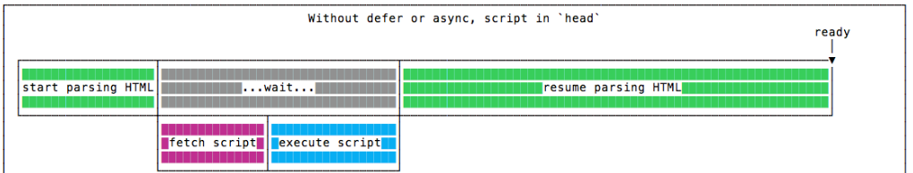
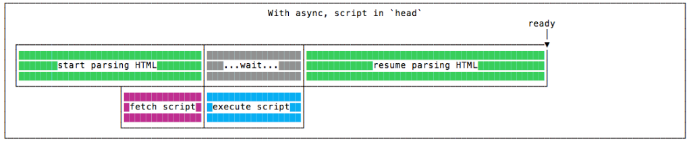
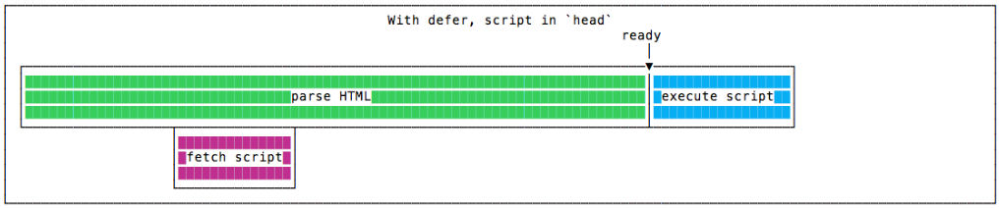

# 6. Ways to improve website performance

1. Reduce the Number of HTTP Requests
2. Optimize Image Sizes
3. Use a Content Delivery Network (CDN)
4. Write Mobile-First Code
5. Minimize Time to First Byte
6. Choose the Right Hosting Service Plan
7. Implement Gzip Compression
8. Minify and Combine CSS, JavaScript, and HTML Files
9. Load JavaScript Asynchronously
10. Consider Using Preload, Prefetch, Preconnect, and Prerender Techniques
11. Reduce the Number of Plugins
12. Use Website Caching

# 7. What does async and defer refer in script tag? Describe the difference between <script>, <script async> and <script defer>

- **script**



- **script async**



- **script defer**



# 18. What is an iframe and how it works?

The **"iframe"** tag defines a rectangular region within the document in which the browser can display a separate document, including scrollbars and borders.

The iframe is basically used to show a webpage (videos, maps, presentations) inside the current web page. The "src" attribute is used to specify the URL of the document that occupies the iframe.

```html
<iframe src="https://someDoc.html" height="200" width="400" loading="lazy"> </iframe>
```

# 19 Explain the use of rel="nofollow", rel="noreferrer", rel="noopener" attribute?

**rel** attribute specifies the relationship between the current document and the linked document.

**The noreferrer** is rel attribute of the "a", "area", and "form" elements instructs the browser, when navigating to the target resource, to omit the Referer header and otherwise leak no referrer information — and additionally to behave as if the noopener keyword were also specified.

**The noopener** is rel attribute of the "a", "area", and "form" elements instructs the browser to navigate to the target resource without granting the new browsing context access to the document that opened it — by not setting the _Window.opener_ property on the opened window (it returns null).

**The nofollow** keyword tells search engine spiders to ignore the link relationship.

# 21. What does CORS stand for and what issue does it address?

**Cross-Origin Resource Sharing (CORS)** is a protocol that enables scripts running on a browser client to interact with resources from a different origin.

_"other origins"_ means the URL being accessed differs from the location that the JavaScript is running from, by having:

- _a different scheme_ (HTTP or HTTPS)
- _a different domain_
- _a different port_

**Flow:**

## **Step 1**: client (browser) request

When the browser is making a cross-origin request, the browser adds an Origin header with the current _origin_ (scheme, host, and port).

## **Step 2**: server response

On the server side, when a server sees this header, and wants to allow access, it needs to add an Access-Control-Allow-Origin header to the response specifying the requesting origin (or \* to allow any origin.)

## **Step 3**: browser receives response

When the browser sees this response with an appropriate _Access-Control-Allow-Origin_ header, the browser allows the response data to be shared with the client site.
