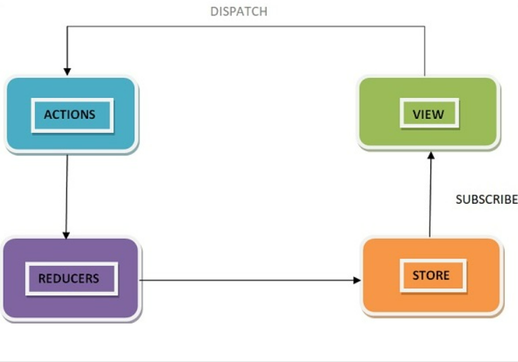

# 1. What is React?

React is a free and open-source front-end JavaScript library for building user interfaces based on UI components.  
React can be used as a base in the development of single-page, mobile, or server-rendered applications.

# 2. What are the major features of React?

- JSX (JavaScript Syntax Extension)
- Virtual DOM
- One-way data binding
- Performance
- Extensions
- Conditional statements
- Components
- Simplicity

# 3. What is JSX?

JSX is an extension of the JavaScript language based on ES6, and is translated into regular JavaScript at runtime.
JSX allows us to write HTML in React.
JSX converts HTML tags into react elements.

_Flow:_

JSX => transpiler (BIBEL) => React.createElement function

# 4. Is it possible to use react without JSX?

YES

React.createElement(type, [props], [...children])

# 5. What is the difference between Element and Component?

**React Element** is the basic building block in a react application, it is an object representation of a virtual DOM node.  
React Element contains both type and property.  
It may contain other Elements in its props.  
React Element does not have any methods, making it light and faster to render than components.

**React Component**: It is independent and reusable.  
It returns the virtual DOM of the element. One may or may not pass any parameter while creating a component.  
A component can be further described into functional components and class components.
Starts from capital letter

| Element                                                                    | Component                                                                                                                           |
| -------------------------------------------------------------------------- | ----------------------------------------------------------------------------------------------------------------------------------- |
| An element is always gets returned by a component.                         | A component can be functional or a class that optionally takes input and returns an element.                                        |
| The element does not have any methods.                                     | Each component has its life cycle methods.                                                                                          |
| A React element is an object representation of a DOM node.                 | A component encapsulates a DOM tree.                                                                                                |
| Elements are immutable i,e once created cannot be changed.                 | The state in a component is mutable.                                                                                                |
| An element can be created using React.createElement( ) with type property. | A component can be declared in different ways like it can be an element class with render() method or can be defined as a function. |
| We cannot use React Hooks with elements as elements are immutable.         | React hooks can be used with only functional components                                                                             |
| Elements are light, stateless and hence it is faster.                      | It is comparatively slower than elements.                                                                                           |

# 6. How to create components in React?

class, functional component (including arrow function)

```jsx
const User = (props) => {
  ///...some logic
  return <div>{props.name}</div>;
};
export default User;
```

# 7. What is state in React?

_state_ is an object that determines how that component renders & behaves.  
"state" is what allows you to create components that are dynamic and interactive.
"state" can be changed

# 8. What are props in React?

Props are arguments passed into React components.

# 9. What is the difference between state and props?

- Components receive data from outside with props, whereas they can create and manage their own data with state
- Props are used to pass data, whereas state is for managing data
- Data from props is read-only, and cannot be modified by a component that is receiving it from outside
- State data can be modified by its own component, but is private (cannot be accessed from outside)
- Props can only be passed from parent component to child (unidirectional flow)

# 10. Why should we not update the state directly?

If we mutate the state directly, it won't change the reference of the state in the previous virtual DOM as well.  
So, React won’t be able to see that there is a change of the state and so it won’t be reflected in the original DOM until we reload.

# 11. Is the state updated synchronously?

State updates are asynchronous. This was true in class-based components. It's true with functions/Hooks

# 12. How to bind methods or event handlers in JSX callbacks?

- **Binding in Constructor**: In JavaScript classes, the methods are not bound by default. The same thing applies for React event handlers defined as class methods.

```js
class Component extends React.Component {
  constructor(props) {
    super(props);
    this.handleClick = this.handleClick.bind(this);
  }
  handleClick() {
    // ...
  }
}
```

- **Public class fields syntax**:

```js
handleClick = () => {
  console.log("this is:", this);
};
```

- **Arrow functions in callbacks:**

```html
<button onClick={(event) => this.handleClick(event)}>{'Click me'}</button>
```

# 13. How to pass a parameter to an event handler or callback?

```jsx
export function App(props) {
  const click = (data, event) => {
    console.log(data, event);
  };
  return (
    <div className="App">
      <button onClick={(e) => click("some data", e)}>click</button> //-1
      <button onClick={click.bind(null, "some another data")}>click</button> //-2
      <button onClick={(e) => click.call(null, "some another another data", e)}>click</button> //-3
    </div>
  );
}
```

# 14. What are synthetic events in React?

_Synthetic events_ - a cross-browser wrapper around the browser’s native event
Helps to avoid creating multiple implementations for multiple methods for multiple browsers, creating common names for all events across browsers. Another benefit is that it increases the performance of the application as React reuses the event object.

# 15. What is "key" prop and what is the benefit of using it in arrays of elements?

A “key” is a special string attribute you need to include when creating lists of elements in React. Keys are used to React to identify which items in the list are changed, updated, or deleted.
Should be Uniqueness of Keys

# 16. What is the use of refs?

**refs** are a way to access underlying DOM elements in a React component

_Cases_ for using refs:

- Managing focus, text selection, or media playback.
- Triggering imperative animations.
- Integrating with third-party DOM libraries.

# 17. How to create refs?

- React.createRef()

```jsx
class MyComponent extends React.Component {
  constructor(props) {
    super(props);
    this.myRef = React.createRef();
  }
  render() {
    return <div ref={this.myRef} />;
  }
}
```

- callback ref

```jsx
class SimpleCallbackRef extends Component {
  onClick() {
    this.inputRef.focus();
  }

  render() {
    return (
      <div>
        <input
          ref={(ref) => {
            this.inputRef = ref;
          }}
        />
        <button onClick={this.onClick.bind(this)}>Click to Focus</button>
      </div>
    );
  }
}
```

- Hooks useRef

```jsx
const RefsWithHooks = () => {
  const inputRef = useRef(null);
  return (
    <div>
      <input ref={inputRef} />
      <button onClick={() => inputRef.current.focus()}>Click to Focus</button>
    </div>
  );
};
```

# 18. React.memo VS useMemo

**React.memo** is a higher-order component (or HOC for short) which accepts a react component and an optional function that uses props to conditionally update the component using memoization

**useMemo** is a react hook that will accept a function and a dependency array and then memoize the value returned from the function passed into it.

In useMemo it remembers the value returned between renders, and in React.memo it remembers the react component between renders.

# 19. How do you memoize a component?

**React.memo** is a higher-order component (or HOC for short) which accepts a react component and an optional function that uses props to conditionally update the component using memoization

# 20. What is Virtual DOM?

Virtual DOM is just a copy of the original DOM kept in the memory and synced with the real DOM by libraries such as ReactDOM. This process is called Reconciliation.
A virtual DOM object has the same properties as a real DOM object, but it lacks the real thing’s power to directly change what’s on the screen.
Manipulating the DOM is slow. Manipulating the virtual DOM is much faster, because nothing gets drawn onscreen.

# 21. How Virtual DOM works?

When anything new is added to the application, a virtual DOM is created and it is represented as a tree.  
Each element in the application is a node in this tree.  
So, whenever there is a change in the state of any element, a new Virtual DOM tree is created.  
This new Virtual DOM tree is then compared with the previous Virtual DOM tree and make a note of the changes.  
After this, it finds the best possible ways to make these changes to the real DOM.  
Now only the updated elements will get rendered on the page again.

_In react_, everything is treated as a component be it a functional component or class component. A component can contain a state. Each time we change something in our JSX file or let’s put it in simple terms, whenever the state of any component is changed react updates its Virtual DOM tree. Though it may sound that it is ineffective but the cost is not much significant as updating the virtual DOM doesn’t take much time. React maintains two Virtual DOM at each time, one contains the updated Virtual DOM and one which is just the pre-update version of this updated Virtual DOM. Now it compares the pre-update version with the updated Virtual DOM and figures out what exactly has changed in the DOM like which components have been changed. This process of comparing the current Virtual DOM tree with the previous one is known as _‘diffing’_. Once React finds out what exactly has changed then it updated those objects only, on real DOM. React uses something called batch updates to update the real DOM. It just means that the changes to the real DOM are sent in batches instead of sending any update for a single change in the state of a component. We have seen that the re-rendering of the UI is the most expensive part and React manages to do this most efficiently by ensuring that the Real DOM receives batch updates to re-render the UI. This entire process of transforming changes to the real DOM is called _Reconciliation_

# 22. What is the difference between Shadow DOM and Virtual DOM?

The only thing which is common for both is that they help with performance issues. Both create a separate instance of the Document Object Model; besides this, both concepts are different. Virtual DOM is creating a copy of the whole DOM object, and Shadow DOM creates small pieces of the DOM object which has their own, isolated scope for the element they represent.

|                   | Shadow DOM                                                                                                 | Virtual DOM                                                                                        |
| ----------------- | ---------------------------------------------------------------------------------------------------------- | -------------------------------------------------------------------------------------------------- |
| What It Is        | An API allowing developers to attach a “hidden” DOM to an element for encapsulation purposes               | An in-memory representation of the DOM                                                             |
| Purpose           | Encapsulate logic and presentation inside an element, protecting it from effects from the rest of the page | Abstract the real DOM away, allowing for better performance and a more declarative style of coding |
| Who Implements It | Browsers                                                                                                   | JavaScript libraries, such as React and Vue                                                        |

# 23. What is React Fiber?

_React Fiber_—the core algorithm behind React. React Fiber is the new reconciliation algorithm in React 16.

# 24. What is the main goal of React Fiber?

The main goals of the Fiber reconciler are incremental rendering, better or smoother rendering of UI animations and gestures, and responsiveness of the user interactions

- Assign priority to different types of work
- Pause work and come back to it later
- Abort work if it’s no longer needed
- Reuse previously completed work

# 25. What is Lifting State Up in React?

If several components need to reflect the same changing data, we can lifting the shared state up to their closest common ancestor.

# 26. What are the different phases of component lifecycle?

- Initializing

This phase involves all the declarations, definitions, and initialization of properties, default props as well as the initial state of the component required by the developer. In a class-based component, this is implemented in the constructor of the component.

- Mounting

It commences when the component is positioned over the DOM container(meaning, an instance of the component is created and inserted into the DOM) and rendered on a webpage.

- Updating

It updates the states and properties that were declared and initialized during the initialization phase (if at all any changes are required). It is also responsible for handling user interaction and passing data within the component hierarchy. Unlike the initialization phase, this phase can be repeated multiple times. Some of the lifecycle methods falling into this category are as follows:

- Unmounting

This phase includes those lifecycle methods which are used when a component is getting detached from the DOM container(meaning, the instance of the component being destroyed and unmounted from the DOM). It is also responsible for performing the required cleanup tasks. Once unmounted, a component can not be re-mounted again.

# 27. What are the lifecycle methods of React?


# 28. What are Higher-Order components?

**HOC** is a function that takes a component and returns a new component.

# 29. How to fetch data with React Hooks?

useEffect + useState or combine them to custom hook

# 30. What is context?

Context provides a way to pass data through the component tree without having to pass props down manually at every level.

# 31. What is children prop?

It is used to display whatever you include between the opening and closing tags when invoking a component.

# 32 What is reconciliation?

Reconciliation is the process through which React updates the Browser DOM

_With details_:

A component can contain a state. Each time we change something in our JSX file or let’s put it in simple terms, whenever the state of any component is changed react updates its Virtual DOM tree. Though it may sound that it is ineffective but the cost is not much significant as updating the virtual DOM doesn’t take much time. React maintains two Virtual DOM at each time, one contains the updated Virtual DOM and one which is just the pre-update version of this updated Virtual DOM. Now it compares the pre-update version with the updated Virtual DOM and figures out what exactly has changed in the DOM like which components have been changed. This process of comparing the current Virtual DOM tree with the previous one is known as _‘diffing’_. Once React finds out what exactly has changed then it updated those objects only, on real DOM. React uses something called batch updates to update the real DOM. It just means that the changes to the real DOM are sent in batches instead of sending any update for a single change in the state of a component. We have seen that the re-rendering of the UI is the most expensive part and React manages to do this most efficiently by ensuring that the Real DOM receives batch updates to re-render the UI. This entire process of transforming changes to the real DOM is called _Reconciliation_

# 33.How do you conditionally render components?

```jsx
if (isLoggedIn) {
  return <UserGreeting />;
}
```

```jsx
return (
    <div>
      The user is <b>{isLoggedIn ? 'currently' : 'not'}</b> logged in.
    </div>
```

```jsx
return <div>{count && <h1>Messages: {count}</h1>}</div>;
```

# 34. What are error boundaries in React v16

**Error boundaries** are React components that catch JavaScript errors anywhere in their child component tree, log those errors, and display a fallback UI

Error boundaries _do not catch errors_ for:

- Event handlers (learn more)
- Asynchronous code (e.g. setTimeout or requestAnimationFrame callbacks)
- Server side rendering
- Errors thrown in the error boundary itself (rather than its children)

```jsx
class ErrorBoundary extends React.Component {
  constructor(props) {
    super(props);
    this.state = { hasError: false };
  }

  static getDerivedStateFromError(error) {
    // Update state so the next render will show the fallback UI.
    return { hasError: true };
  }

  componentDidCatch(error, errorInfo) {
    // You can also log the error to an error reporting service
    logErrorToMyService(error, errorInfo);
  }

  render() {
    if (this.state.hasError) {
      return <h1>Something went wrong.</h1>;
    }

    return this.props.children;
  }
}
```

# 35. What are hooks?

Let us use state and other React features without writing a class

# 36. React hooks rules

- Only Call Hooks at the Top Level

Don’t call Hooks inside loops, conditions, or nested functions

- Only Call Hooks from React Functions

# 37. What are fragments?

_Fragments_ are syntax that allow us to add multiple elements to a React component without wrapping them in an extra DOM node.

# 38. Why fragments are better than container divs?

Allow us to add multiple elements to a React component without wrapping them in an extra DOM node.

# 39. What is Flux?

_Flux_ is an architectural pattern proposed by Facebook for building SPAs.

It suggests to split the application into the following parts:

- Stores
- Dispatcher
- Views
- Action / Action Creators

_Flux flow_


**Pros**
Flux architecture is better in an application where views don’t map directly to domain stores. To put in a different way, when views can create actions that will update many stores and stores can trigger changes that will update many views.

Actions can be persisted and then replayed.

**Cons**
Flux can add unnecessary complexity to an application where each view maps to one store. In this kind of application a separation between view and store is enough.

# 40. What is Redux?

_Redux_ is a predictable state container for JavaScript apps. As the application grows, it becomes difficult to keep it organized and maintain data flow. Redux solves this problem by managing application’s state with a single global object called Store. Redux fundamental principles help in maintaining consistency throughout your application, which makes debugging and testing easier.

_Flow_



# 41. What hooks does Redux have

useSelector, useDispatch, useStore

# 42. What are the core principles of Redux?

- Single source of truth

The global state of your application is stored in an object tree within a single store.

- State is read-only

The only way to change the state is to emit an action, an object describing what happened.

- Changes are made with pure functions

To specify how the state tree is transformed by actions, you write pure reducers.

# 43. What are the downsides of Redux compared to Flux?


# 44. Can I dispatch an action in reducer?

Dispatching an action within a reducer is an anti-pattern. Your reducer should be without side effects, simply digesting the action payload and returning a new state object. Adding listeners and dispatching actions within the reducer can lead to chained actions and other side effects.

# 45 How to access Redux store outside a component?

- Export the Store
- Access Redux State from a Thunk
- Use Middleware and Intercept an Action
- Pass the Value From a React Component

# 46. What is the difference between React context and React Redux?

| Context API                                                                         | Redux                                                                                |
| ----------------------------------------------------------------------------------- | ------------------------------------------------------------------------------------ |
| Built-in tool that ships with React                                                 | Additional installation Required, driving up the final bundle size                   |
| Requires minimal Setup                                                              | Requires extensive setup to integrate it with a React Application                    |
| Specifically designed for static data, that is not often refreshed or updated       | Works like a charm with both static and dynamic data                                 |
| Adding new contexts requires creation from scratch                                  | Easily extendible due to the ease of adding new data/actions after the initial setup |
| Debugging can be hard in highly nested React Component Structure even with Dev Tool | Incredibly powerful Redux Dev Tools to ease debugging                                |
| UI logic and State Management Logic are in the same component                       | Better code organization with separate UI logic and State Management Logic           |

# 47. Should I keep all component's state in Redux store?

No. As usual - data from server or states that should be available in many places

# 48. What is the proper way to access Redux store?

Class components : **Connect with mapStateToProps, mapDispatchToProps** or FC : **useSelector**

# 49. What is the purpose of the constants in Redux?

Types of action writes with constants allow us change them in one place without grammatical errors

# 50. What is an action in Redux?

Actions are plain JavaScript object that must have a type attribute to indicate the type of action performed. It tells us what had happened. Types should be defined as string constants. Other keys - are optional.

# 51 What hooks does React Router (v6) have

**v6**
useHref, useInRouterContext, useLinkClickHandler, useLinkPressHandler, useLocation, useMatch, useNavigate, useNavigationType, useOutlet, useOutletContext, useParams, useResolvedPath, useRoutes, useSearchParams

**v5**
useHistory, useLocation, useParams, useRouteMatch

# 52 How React Router is different from history library?

React Router is a wrapper around the history library which handles interaction with the browser's _window.history_ with its browser and hash histories.
