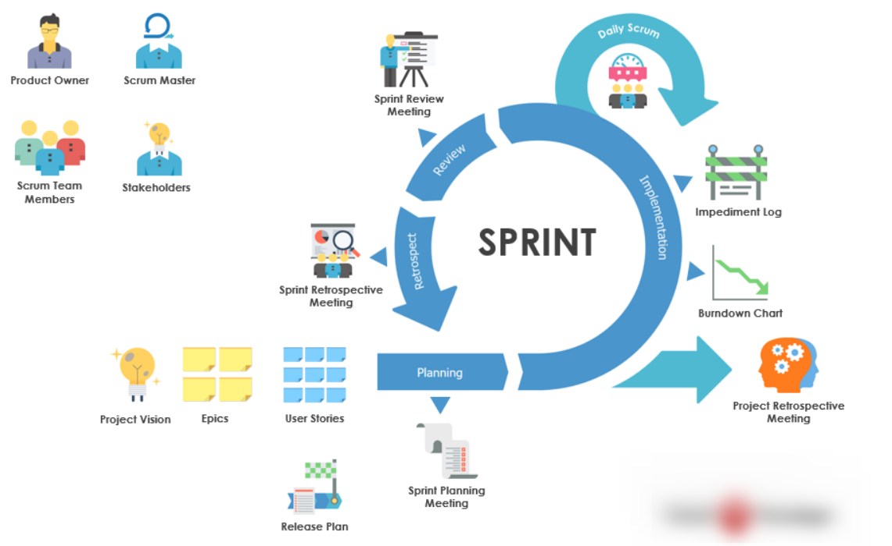
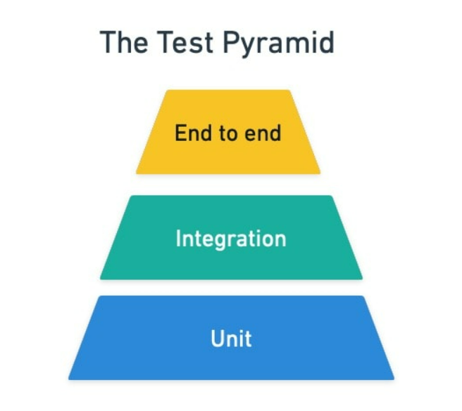
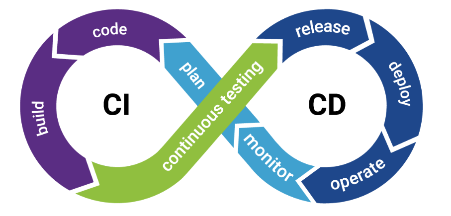

# 1. What is SCRUM?

_Scrum_ is an agile development methodology used in the development of Software based on an iterative and incremental processes.

_Features_: adaptable, fast, flexible and effective agile framework that is designed to deliver value to the customer throughout the development of the project.

_The primary objective_ of Scrum is to satisfy the customer’s need through an environment of transparency in communication, collective responsibility and continuous progress.

# 2. SCRUM Roles

**Scrum master**:  
The person who leads the team guiding them to comply with the rules and processes of the methodology. Scrum master manages the reduction of impediments of the project and works with the Product Owner to maximize the ROI. The Scrum Master is in charge of keeping Scrum up to date, providing coaching, mentoring and training to the teams in case it needs it.

**Product owner (PO)**:  
Is the representative of the stakeholders and customers who use the software. They focus on the business part and is responsible for the ROI of the project. They Translate the vision of the project to the team, validate the benefits in stories to be incorporated into the Product Backlog and prioritize them on a regular basis.

**Team**:  
A group of professionals with the necessary technical knowledge who develop the project jointly carrying out the stories they commit to at the start of each sprint.

# 3. Ceremonies

- Sprint Planning

Sprint Planning is the scrum ceremony designed to make sure the team is prepared to get the right things done every sprint.

- Daily Scrum

The Daily Scrum is the team’s chance to get together, define a plan for the day’s work, and identify any blockers.

- Sprint Review

The Sprint Review is the scrum ceremony where all work completed during the sprint can be showcased the stakeholders.

- Sprint Retrospective

The Sprint Retrospective is the final scrum ceremony in the sequence that allows the team to look back on the work that was just completed and identify items that could be improved.

- Backlog Refinement

Product Backlog refinement (formerly backlog grooming) helps agile teams improve their development process by ensuring the team always has well-defined issues to be tackled in future sprints.

# 4. Artifacts

_Product Backlog_

The product backlog is an ordered list of everything that is known to be needed in a product based on the product goal. It is constantly evolving and is never complete.

_Sprint Backlog_

The sprint backlog is a list of everything that the team commits to achieve in a given sprint. Once created, no one can add to the sprint backlog except the development team.

_Potentially Releasable Product Increment_

At the end of every sprint, the team delivers a product increment that is potentially releasable, meaning that it meets their agreed-upon definition of done.

# 5. Agile Manifest

- Individuals and interactions over processes and tools

- Working software over comprehensive documentation

- Customer collaboration over contract negotiation

- Responding to change over following a plan

# 6. Scrum Cycle

# 7. SCRUM Estimation

The size of the Product Increment is estimated in terms of User Story Points. Once the size is determined, the effort is estimated by means of the past data, i.e., effort per User Story Point called Productivity.

The Scrum Estimation of User Stories is in terms of the degree of difficulty for each of the User Stories. To assess the degree of difficulty, a particular scale is used.

There are several types of scales that are used in Scrum Estimation. Following are some examples -

- Numeric Sizing (1 through 10)
- T-shirt Sizes (XS, S, M, L, XL XXL, XXXL)
- Fibonacci Sequence (1, 2, 3, 5, 8, 13, 21, 34, etc.)
- Dog Breeds (Chihuahua,………,Great Dane)

The estimation technique is normally chosen in such a way that the entire scrum team is acquainted and comfortable with scale’s values. The most commonly used and most popular technique is Planning Poker which is based on Fibonacci sequence.

# 8. How do you estimate a task?

Team defines the simplest task with story point = 1

# 9. Testing Pyramid

The "Testing Pyramid" is an industry-standard guideline for functional test case development.

# 10. Unit Tests

_Unit test_ is a method that instantiates a small portion of our application and verifies its behavior independently from other parts.  
A typical unit test contains 3 phases:

- it initializes a small piece of an application it wants to test (also known as the system under test, or SUT),
- it applies some stimulus to the system under test (usually by calling a method on it)
- it observes the resulting behavior.

If the observed behavior is consistent with the expectations, the unit test passes, otherwise, it fails, indicating that there is a problem somewhere in the system under test. These three unit test phases are also known as Arrange, Act and Assert, or simply AAA.

# 11. Design Patterns. Definition

_Design patterns_ represent the best practices used by experienced object-oriented software developers.

_Design patterns_ are solutions to general problems that software developers faced during software development.

These solutions were obtained by trial and error by numerous software developers over quite a substantial period of time.

# 12. Benefits of Patterns

- Design patterns help you analyze the more abstract areas of a program by providing concrete, well-tested solutions.
- Design patterns help you write code faster by providing a clearer picture of how you are implementing the design.
- Design patterns encourage code reuse and accommodate change by supplying well-tested mechanisms for delegation and composition, and other non-inheritance based reuse techniques.
- Design patterns encourage more legible and maintainable code by following well-understood paths.
- Design patterns increasingly provide a common language and jargon for programmers.

# 13. Creational Patterns

These design patterns provide a way to create objects while hiding the creation logic, rather than instantiating objects directly using new operator.

This gives program more flexibility in deciding which objects need to be created for a given use case.

_Factory method_, _Abstract factory_, _builder_, _prototype_, _singlton_

# 14. Behavioral Patterns

These design patterns are specifically concerned with communication between objects.

_Chain of responsibility_, _command_, _iterator_, _mediator_, _observer_, _state_, _strategy_, _visitor_

# 15. SOLID Principles

**S:** Single Responsibility Principle

A class should have one and only one reason to change, meaning that a class should only have one job.

**O:** Open-Closed Principle

Objects or entities should be open for extension, but closed for modification.

**L:** Liskov Substitution Principle

Subclass should override the parent class methods in a way that does not break functionality from a client’s point of view.

**I:** Interface Segregation Principle

A client should never be forced to implement an interface that it doesn’t use or clients shouldn’t be forced to depend on methods they do not use.

**D:** Dependency Inversion Principle

Entities must depend on abstractions not on concretions. It states that the high level module must not depend on the low level module, but they should depend on abstractions.

# 16. CI/CD/CD

Continuous integration (CI) and continuous delivery & Continuous deployment (CD) are essential terms that are used in DevOps and encompass a set of practices that enable modern development teams to deliver code changes more frequently and quickly.

CI/CD/CD represent the process of continuous development, testing and delivery of new releases.

Three main concepts:

**Continuous integration (CI)**- short-lived branches that are merged into a shared trunk several times a day where a series of automated tests give feedback about the changes introduced

**Continuous delivery (CD)**- after continuous integration, continuous delivery prepares the software for delivery; deployment to production is usually manual

**Continuous deployment**- after CI and CD, changes are automatically deployed into production; fully automated process
